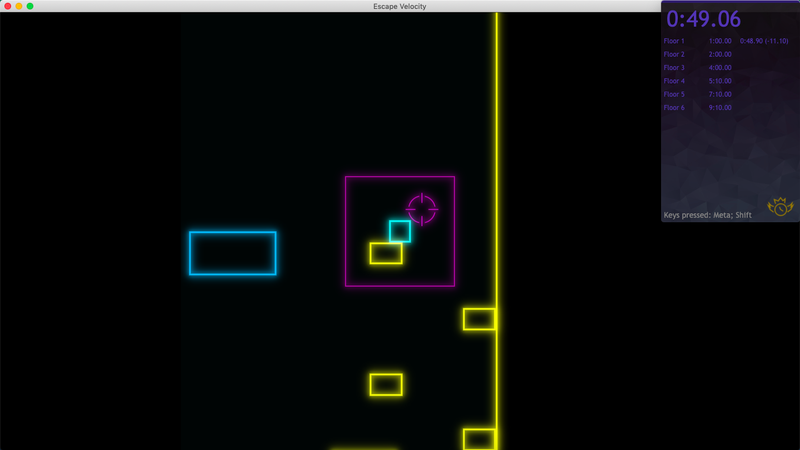

# Runtime Speedrun Tools

# [Download](https://github.com/yikuansun/desktopspeedruntools/releases)

## Features
- [x] Global hotkeys to control stopwatch
- [x] Display of which keys are currently being pressed
- [x] Comparison RTA splits with goal times
- [x] Customizable stopwatch countdown
- [x] Customizable fonts, colors
- [x] Draggable popup window
- [x] Translucent popup window

## Usage
Download the app. Open it. Close by right-clicking anywhere on the popup and pressing __Close Runtime__. The app may lag at first; check if it is ready by pressing a key and seeing if it appears after __Keys pressed__ (shown at the bottom of the popup). To move the popup, simply drag it. Start, stop, or restart the stopwatch using __Alt__; record splits by pressing __Shift__. Change information about the splits by right-clicking the popup and pressing __Edit Splits__. Edit the table and press __Save splits__ to save them. Edit your settings by right-clicking the popup and pressing __Open Settings__. Once settings are changed, press the __Save settings__ button.

## Running an unpackaged version
Clone this repository to your local machine. Make sure you have Node.js and `npm` installed. In your command line, use `cd` to navigate to this repository's directory, then run `npm install`. After all of the packages have been installed, run `npm start` to open the app.
